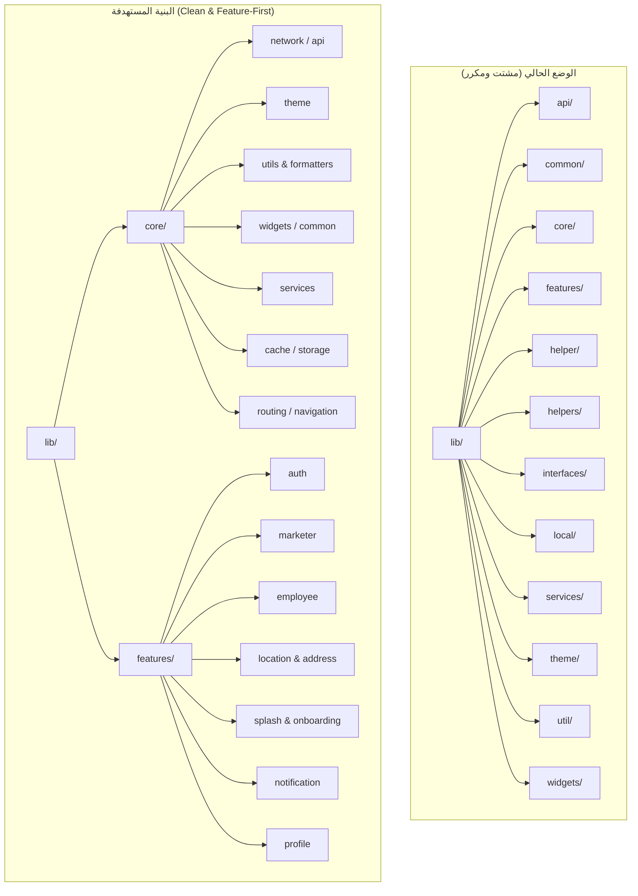

# 🏛️ خطة إعادة هيكلة وترتيب المشروع (Clean Core & Feature Architecture)

> [!IMPORTANT]
> **الهدف الاستراتيجي:** تحويل بنية المشروع من 12 مجلداً مشتتاً ومكرراً في جذر `lib/` إلى مجلدين أساسيين فقط:
> 1. `lib/core/` (كل ما هو مشترك، بنيوي، وتقني عام)
> 2. `lib/features/` (كل ما هو وظيفي وموديولي خاص بميزة معينة)

---

## 📊 1. الوضع الحالي مقابل البنية المستهدفة

### مقارنة جذر المجلدات (`lib/`)



---

## 🗺️ خريطة توزيع المجلدات القديمة إلى البنية الجديدة

| المجلد الحالي | الوجهة المستهدفة | طبيعة المحتويات |
| :--- | :--- | :--- |
| `lib/api/` + `lib/common/api/` + `lib/core/api/` | `lib/core/network/` | `api_client.dart`, `api_checker.dart`, interceptors, headers |
| `lib/theme/` | `lib/core/theme/` | `light_theme.dart`, `dark_theme.dart`, `styles.dart`, `colors.dart` |
| `lib/util/` + `lib/common/utils/` + `lib/core/utils/` | `lib/core/utils/` | `app_constants.dart`, `dimensions.dart`, `environment_config.dart` |
| `lib/widgets/` + `lib/common/widgets/` | `lib/core/widgets/` | الأزرار المشتركة، حقول الإدخال، الـ AppBar الموحد، الـ Dialogs |
| `lib/services/` + `lib/common/services/` | `lib/core/services/` | `secure_token_loader.dart`, `pusher_service.dart`, `edge_to_edge_service.dart` |
| `lib/local/` + `lib/core/cache/` + `lib/common/cache/` | `lib/core/cache/` | `hive_home_cache_service.dart`, `cache_manager.dart` |
| `lib/interfaces/` | `lib/core/base/` أو داخل الفيتشرز | `repository_interface.dart` |
| `lib/helpers/` (ملف وحيد) | `lib/core/utils/screen_logger.dart` | حذف مجلد `helpers` المكرر |
| `lib/helper/` (ملفات مختلطة) | توزيع مخصص: <br>• ميزات -> `features/`<br>• عام -> `core/` | • `route_helper.dart` -> `core/routes/`<br>• `auth_helper.dart` -> `features/auth/helpers/`<br>• `address_helper.dart` -> `features/address/helpers/`<br>• `notification_helper.dart` -> `features/notification/helpers/` |

---

## 📅 خطة التنفيذ الموزعة على 4 أيام (4-Day Roadmap)

### 🗓️ اليوم الأول: تأسيس الـ Core الموحد والقضاء على التكرار السطحي
> [!NOTE]
> التركيز في هذا اليوم على المجلدات الصغيرة المكررة والخدمات الأساسية دون المساس بشاشات التطبيق لضمان استقرار البناء.

- [x] **الخطوة 1.1:** دمج مجلد `lib/helpers/` (المكرر) في `lib/core/utils/screen_logger.dart` وحذف مجلد `helpers`.
- [x] **الخطوة 1.2:** نقل `lib/interfaces/` ومحتويات `lib/local/` إلى `lib/core/base/` و `lib/core/cache/`.
- [x] **الخطوة 1.3:** دمج مجلد `lib/theme/` بالكامل إلى `lib/core/theme/`.
- [x] **الخطوة 1.4:** دمج `lib/widgets/` إلى `lib/core/widgets/`.
- [x] **الخطوة 1.5:** إنشاء Barrel Files (ملفات تصدير `index/export`) مؤقتة للحفاظ على استقرار الـ imports وعدم حدوث أخطاء كسر.
- [x] **التحقق:** تشغيل `dart analyze` والتأكد من انعدام أخطاء الاستيراد (تم التحقق بنجاح 0 أخطاء).

---

### 🗓️ اليوم الثاني: توحيد طبقة الشبكة (Network / API) والكاش (Cache / Storage)
> [!NOTE]
> التركيز على دمج التشتت الثلاثي السابق (`api/` و `common/api/` و `core/api/`) في طبقة موحدة واحدة.

- [x] **الخطوة 2.1:** إنشاء `lib/core/network/` وجمع:
  - `ApiClient`, `ApiChecker`, `LocalClient`
  - `SecureHttpClient`, `ApiCallManager`, `OptimizedApiClient`
- [x] **الخطوة 2.2:** توحيد الكاش في `lib/core/cache/`:
  - `HiveHomeCacheService`
  - `CacheManager`
  - `SecureTokenStorage`
- [x] **الخطوة 2.3:** نقل `services/` العامة (`edge_to_edge_service`, `app_version_service`, `notification_popup_service`, `secure_token_loader`, `pusher_service`) إلى `lib/core/services/`.
- [x] **الخطوة 2.4:** تحديث حقن التبعيات في `get_di.dart` وضبط Forward Exports في المسارات القديمة لمنع أي كسر في الاستيرادات.
- [x] **التحقق:** فحص التحليل البرمجي عبر `dart analyze` واجتيازه بنجاح كامل (0 أخطاء).

---

### 🗓️ اليوم الثالث: تفكيك مجلد `lib/helper/` وتوزيع المسؤوليات
> [!TIP]
> مجلد `helper` الحالي يحتوي على 26 ملفاً خليطاً بين أدوات عامة ووظائف تابعة مباشرة لميزات محددة. سيتم فرزها ونقل كل مساعد إلى مكانه الصحيح.

- [ ] **الخطوة 3.1: نقل الـ Helpers التابعة للفيتشرز إلى مجلداتها:**
  - `auth_helper.dart` & `centralize_login_helper.dart` ➡️ `features/auth/helpers/`
  - `address_helper.dart` ➡️ `features/address/helpers/`
  - `notification_helper.dart` & `firebase/` ➡️ `features/notification/helpers/`
  - `splash_route_helper.dart` ➡️ `features/splash/helpers/`
- [ ] **الخطوة 3.2: نقل الـ Helpers التقنية العامة إلى `lib/core/utils/`:**
  - `date_converter.dart`, `price_converter.dart`, `custom_validator.dart`
  - `responsive_helper.dart`, `getx_helper.dart`, `network_info.dart`
- [ ] **الخطوة 3.3: تخصيص مسار مركزي للتوجيه:**
  - نقل `route_helper.dart` و `get_di.dart` إلى `lib/core/routes/` و `lib/core/di/`.
- [ ] **الخطوة 3.4:** حذف مجلد `lib/helper/` بالكامل بعد تفريغه.
- [ ] **التحقق:** اختبار كامل لمسارات التنقل بين الشاشات وتسجيل الدخول.

---

### 🗓️ اليوم الرابع: تنظيف جذر المشروع وتوحيد الـ Features والتلميع النهائي
> [!IMPORTANT]
> اليوم الختامي لتحقيق الهدف: لن يتبقى داخل `lib/` سوى `core/` و `features/` و `main.dart` و `firebase_options.dart`.

- [ ] **الخطوة 4.1:** دمج ما تبقى من مجلد `lib/common/` داخل `lib/core/widgets/` وحذف `lib/common/`.
- [ ] **الخطوة 4.2:** دمج مجلد `lib/util/` بالكامل داخل `lib/core/utils/` وحذف `lib/util/`.
- [ ] **الخطوة 4.3:** توحيد البنية الداخلية لكل ميزة داخل `features/` لتتبع نمطاً موحداً:
  ```text
  features/<feature_name>/
  ├── controllers/
  ├── domain/ (models, repositories, services)
  ├── screens/ (أو presentation/views)
  └── widgets/
  ```
- [ ] **الخطوة 4.4:** تشغيل أداة التنسيق والتحليل الشامل:
  ```bash
  dart fix --apply
  dart format lib/
  flutter analyze
  ```
- [ ] **الخطوة 4.5:** بناء نسخة Release APK وتجربتها للتأكد من الجاهزية بنسبة 100%.

---

## 🛡️ استراتيجية الأمان أثناء التنفيذ (Zero Breaking Changes)

1. **استخدام Export Redirection (المؤقت):**
   عند نقل أي ملف، نترك ملفاً مؤقتاً في المسار القديم يحتوي على `export 'new_path';` لضمان عدم توقف المشروع أثناء العمل على مرحلة معينة، ثم نقوم بتنظيف الـ exports بنهاية كل يوم.
2. **الالتزام بالـ Git Commits اليومية:**
   كل مرحلة تنجز في فرع منفصل وتختبر قبل دمجها.
3. **عدم تغيير أي منطق أعمال (Business Logic):**
   العملية هي **Refactoring هيكلي فقط** ولا تتضمن تعديل أي خوارزميات أو استدعاءات API.
